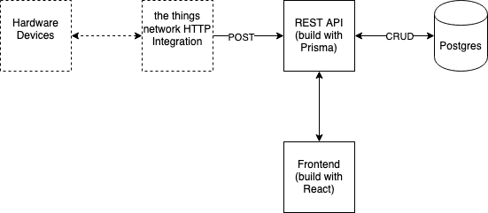
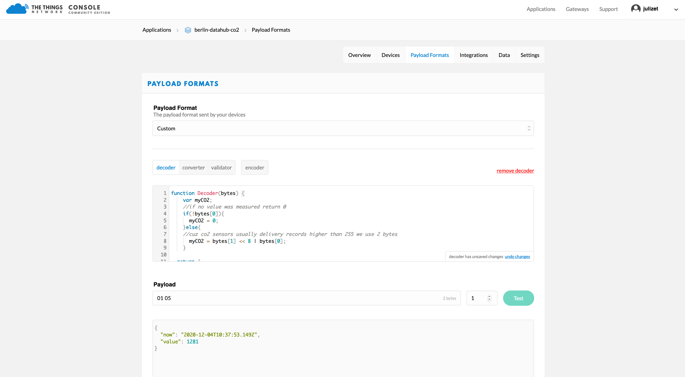
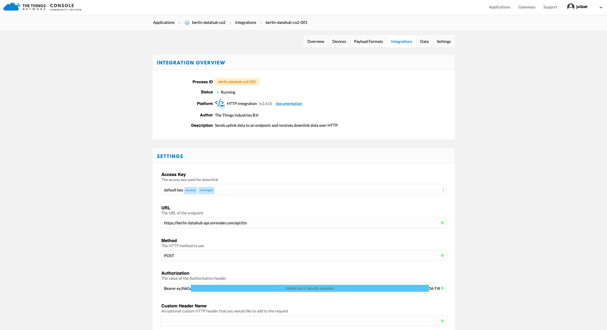

# Berlin IoT Hub API

<!-- @import "[TOC]" {cmd="toc" depthFrom=2 depthTo=6 orderedList=false} -->

<!-- code_chunk_output -->

- [Berlin IoT Hub API](#berlin-iot-hub-api)
  - [Berlin IoT Hub Technology Stack](#berlin-iot-hub-technology-stack)
  - [Development](#development)
    - [Environment Variables](#environment-variables)
    - [Prerequisites](#prerequisites)
    - [Setup](#setup)
    - [Work on it](#work-on-it)
  - [Test](#test)
  - [Deploy](#deploy)
  - [API Interaction + Documentation](#api-interaction--documentation)
  - [Docs](#docs)
  - [HOW TO: connect a TTN application with IoT Data Hub](#how-to-connect-a-ttn-application-with-iot-data-hub)
    - [Step 1: sensor](#step-1-sensor)
    - [Step 2: payload aka. decoder function](#step-2-payload-aka-decoder-function)
    - [Step 3: HTTP Integration](#step-3-http-integration)

<!-- /code_chunk_output -->

## Berlin IoT Hub Technology Stack

The Berlin IoT Hub consists of two components, namely: an RESTful API and a frontend. All of these components are administrated within their very own Repository stored in

- [github.com/technologiestiftung/berlin-datahub-api](https://github.com/technologiestiftung/berlin-datahub-api)
- [github.com/technologiestiftung/berlin-iot-hub-frontend](https://github.com/technologiestiftung/berlin-iot-hub-frontend)



## Development

The API is written in Typescript and uses Express.js + and Prisma.

### Environment Variables

You can find an example `.env` file under [./prisma/env.example](./prisma/env.example). Make sure to obtain an [LogDNA Key](https://logdna.com/) to connect to your account. (You can get this by going to the addon section on render.com).

### Prerequisites

- Node.js >= 12
- Docker >= 19

### Setup

```bash

docker-compose up
npm ci
```

### Work on it

```bash
# Assumes you habe a posstgres DB running
npm run dev
```

## Test

Uses Jest. Prisma creates for each test run a sqlite DB. Currently this is fine. We might need to switch to a Postgres setup later on.

```bash
npm t
```

## Deploy

The API is deployed to [render.com](https://render.com). You can find all definition in [render.yaml](render.yaml). Deploy via Infrastructure as Code. Don't forget to add your environment variables.

## API Interaction + Documentation

This api provides some endpoints for posting data over HTTP. You need an user account to do that. You can find many examples in the file [http-requests/api.http](http-requests/api.http). This file can be used with the [VSCode Rest Client Extension](https://github.com/Huachao/vscode-restclient). Make sure to create your `.env` file there from the provided example under [./http-requests/env.example](./http-requests/env.example).

## Docs

Docs are generated using [typedoc](http://typedoc.org/) and deployed to [github pages](https://technologiestiftung.github.io/berlin-datahub-api/).

## HOW TO: connect a TTN application with IoT Data Hub

If you want to connect you very own TTN application and their devices with the IoT Data Hub you'll need:

1. a sensor which measures something
2. a proper payload aka. decoder function
3. to activate the official TTN HTTP Integration and configurate it

### Step 1: sensor

This is the most obvious step and propably comes by default if you already found your way to our repo. To show the data which was measured by your sensors in the IoT Data Hub, of course, you'll need a sensor which already measures some data e.g. temperature, CO2, dezibel, pressure etc.., first.

### Step 2: payload aka. decoder function

So far, our API only can handle **one record** per device. In order to handle the incoming payloads in a way our API is aware of what is happening, you simply have to update the payload aka. decoder function in your very own TTN application. You measrued data, e.g. CO2 value, needs to be returned as "value" otherwise our API wont recognize it. Please see the following example for a simple CO2-sensor below:

```javascript
function Decoder(bytes) {
  var myCO2;
  //if no value was measured return 0
  if (!bytes[0]) {
    myCO2 = 0;
  } else {
    //cuz co2 sensors usually delivery records higher than 255 we look at 2 bytes of the uplink
    myCO2 = (bytes[1] << 8) | bytes[0];
  }

  return {
    now: new Date().toISOString(),
    value: myCO2,
  };
}
```

You can simply test your decoder function by simulating an uplink. In our case we simply used a payload with the hexadecimal values of **01 05**. Our decoder function now returns us a decimal value of 1281. Time to open the window and let some fresh air in!



### Step 3: HTTP Integration

The IoT Data Hub uses a RESTful API and therefore can be used by any device which is communicating over HTTP. Luckily, the TTN Community already provides a very powerful built-in integration to wire the incoming payload messages (MQTT) with the HTTP protocol. To use this HTTP integration for the API, simply follow these steps:

1. navigate to the overview of your TTN application
2. in the menu to the top right click on **Integrtions**
3. choose **HTTP Integration** to activate it
4. enter a process ID e.g. berlin-datahub-co2
5. enter the URL: https://berlin-datahub-api.onrender.com/api/ttn
6. enter Method: POST
7. enter "Bearer" + your very own Authorization token (you''ll get this from the admin of the IoT Data Hub by request --> just send us a ping)



By finally setting up the HTTP integration, your part is done and everything should work as expected. Yeah. However, if you're going to test the API be simulating some uplinks, you'll will notice that no record and even no application will appear in the IoT Data Hub Frontend.

Don't worry! This is because we have to add your application and your sending device manually first. So: please don't hesitate to get in contact and tell us your AppID & the ID of your device(s) which is/are sending. We will send you your very own Authorization token and configure our DB so you can finally see your sensor data [our Frontend](https://berlin-iot-hub.netlify.app/)
