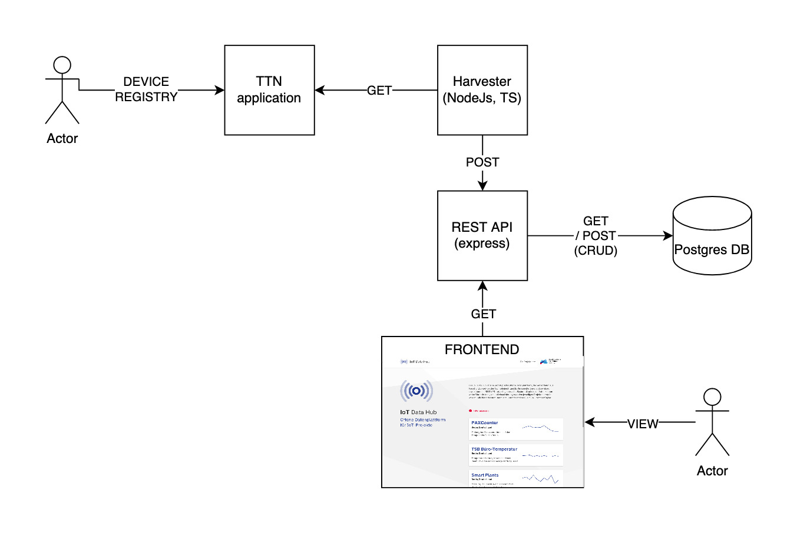

# berlin-datahub-api

## Berlin Data Hub Technology Stack

The Berlin Data Hub consists of two components, namely: an RESTful API and a frontend. All of these components are administrated within their very own Repository stored in the (Technologiestiftung Berlin GitHub Account)[https://github.com/technologiestiftung].

Following, the components are listet:

- RESTful API: Typescript, ExpressJS, Prisma
- frontend: React

We use a PostgreSQL version 11 as database.

