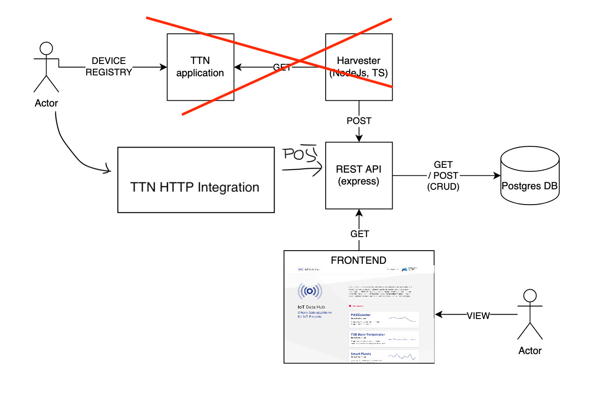

# berlin-datahub-api

<!-- @import "[TOC]" {cmd="toc" depthFrom=2 depthTo=6 orderedList=false} -->

<!-- code_chunk_output -->

- [Berlin Data Hub Technology Stack](#berlin-data-hub-technology-stack)
- [Posting Data](#posting-data)
  - [Retrieve an access token](#retrieve-an-access-token)
  - [Create Device](#create-device)
  - [Post a Record to a Device](#post-a-record-to-a-device)
- [Getting Data](#getting-data)
  - [Devices](#devices)

<!-- /code_chunk_output -->

## Berlin Data Hub Technology Stack

The Berlin Data Hub consists of two components, namely: an RESTful API and a frontend. All of these components are administrated within their very own Repository stored in the (Technologiestiftung Berlin GitHub Account)[https://github.com/technologiestiftung].

Following, the components are listet:

- RESTful API: Typescript, ExpressJS, Prisma
- frontend: React

We use a PostgreSQL version 11 as database.




## Posting Data

This api provides some endpoints for posting data over http. You need an existing user to do that.

### Retrieve an access token

```bash
curl --location --request POST 'http://localhost:4000/api/login' \
--header 'Content-Type: application/json' \
--data-raw '{"username":"you",
"password":"supersecret"}'
```

### Create Device

```bash
curl --location --request POST 'http://localhost:4000/api/devices' \
--header 'Authorization: Bearer abc123' \
--header 'Content-Type: application/json' \
--data-raw '{
    "ttnDeviceId": "ping-01",
    "ttnAppId": "ping"
}'
```

### Post a Record to a Device

```bash
curl --location --request POST 'http://localhost:4000/api/devices/1/records' \
--header 'Authorization: Bearer 123.abc.cad' \
--header 'Content-Type: application/json' \
--data-raw '{
    "value": 963,
    "recordedAt": "2020-10-20T16:35:07.763Z"
}'
```

## Getting Data

### Devices

 ```bash
curl --location --request GET 'http://localhost:4000/api/devices'
```


